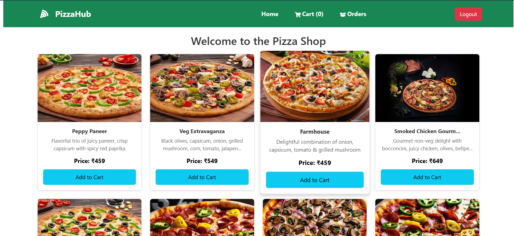
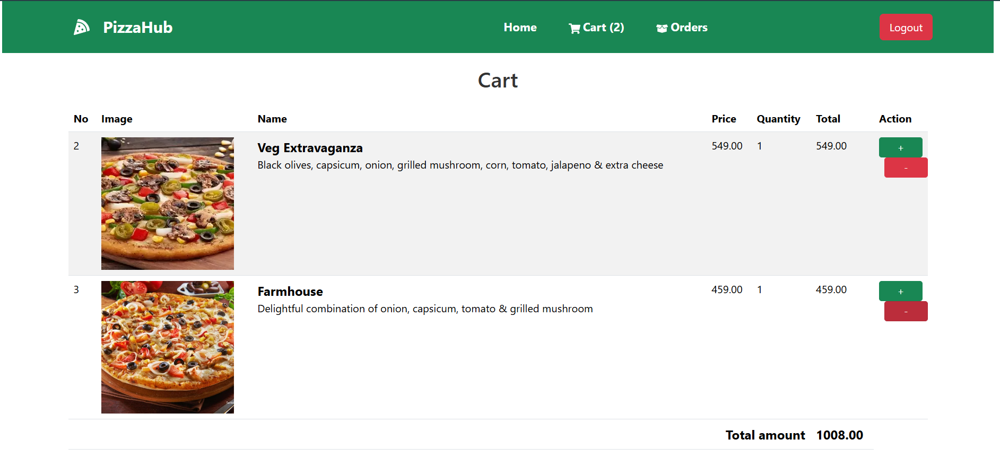
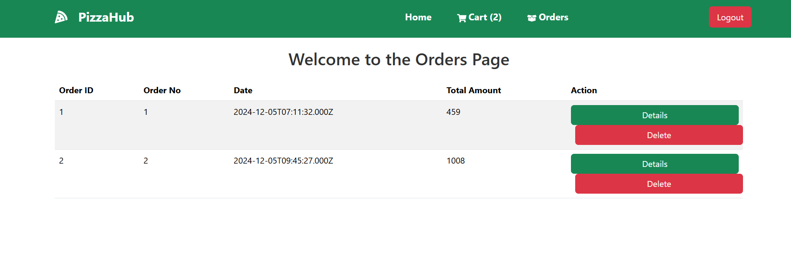

# Slice of Heaven 🍕
Welcome to **Slice of Heaven**, a full-featured pizza shop application built with the **MERN stack** (MySQL, Express.js, React.js, Node.js). 
This project enables users to browse a delicious range of pizzas, customize their orders, and manage their cart efficiently.

## 🚀 Features
- User-friendly interface for pizza browsing and ordering.
- Secure user authentication with JWT.
- Cart management with real-time updates.
- Fully responsive design for all devices.

## 🛠️ Technologies Used
- **Frontend**: React.js, Redux, Bootstrap
- **Backend**: Node.js, Express.js, MySQL
- **Authentication**: JWT-based authentication
- **Styling**: Bootstrap for responsive design

---

## 📸 Screenshots
Here are some screenshots of the application:

### Home Page

### Cart Page

### Orders Page

---

## 💻 Installation

### Prerequisites
- Node.js installed
- MongoDB running locally or a connection string to a remote MongoDB server

### Steps
1. Clone the repository:
   git clone https://github.com/your-username/slice-of-heaven.git

2. Navigate to the project directory:
   cd slice-of-heaven
   Install dependencies:

3. Install frontend dependencies
   cd Frontend
   npm install

3. Install backend dependencies
   cd ../Backend
   npm install

4. Update db.js
   create database locally/ run db.sql file
   change username, password

5. Start backend
   cd server
   npm run dev

6. Start frontend
   cd ../client
   npm start

